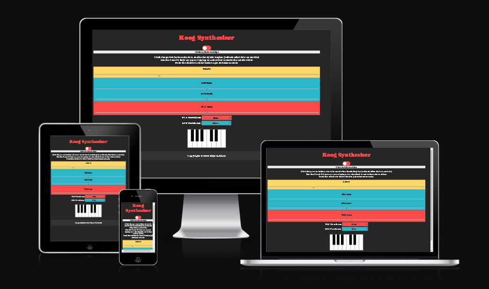
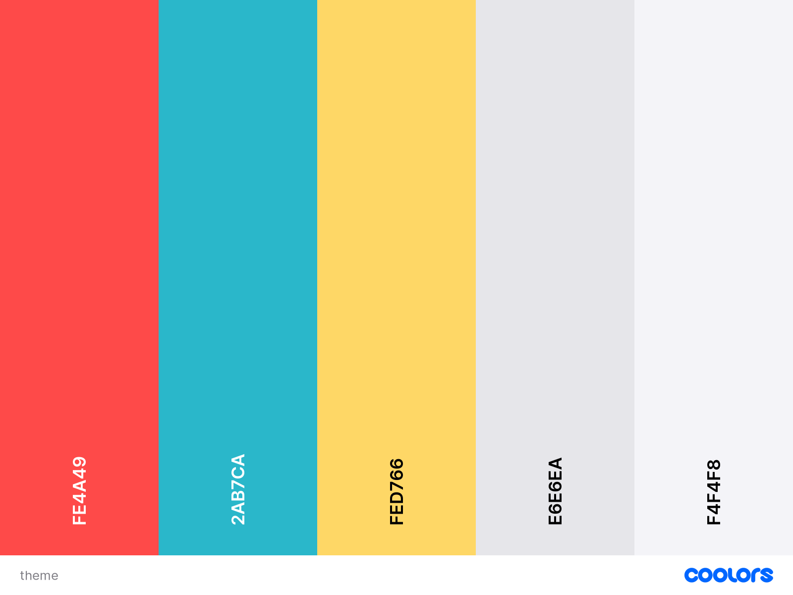
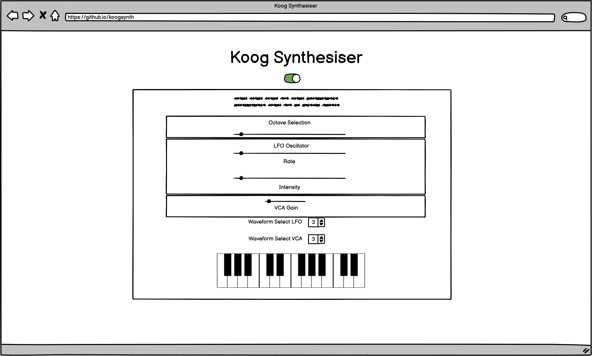
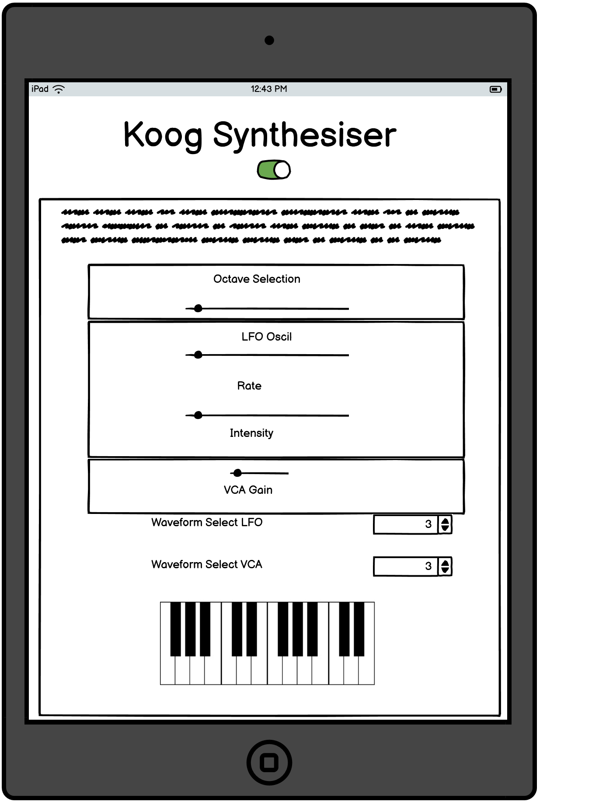
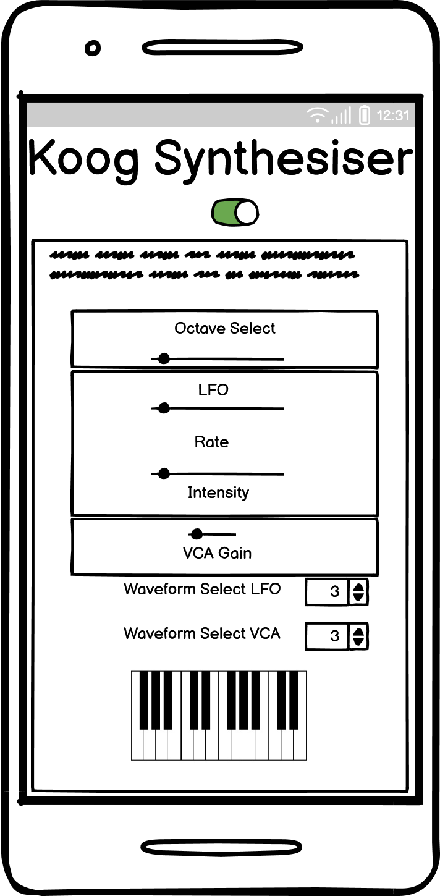
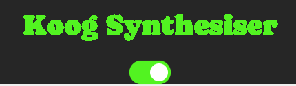
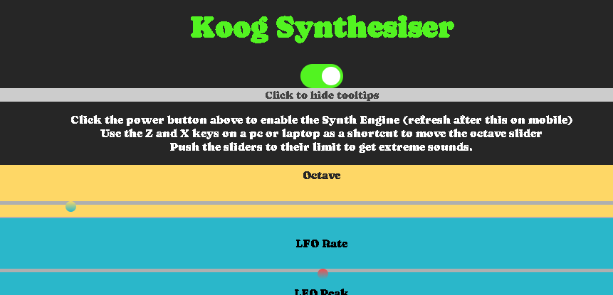
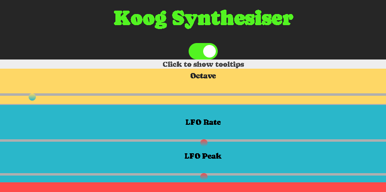
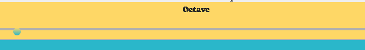
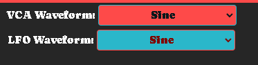

# KoogSynth
A Javacript Synthesiser

This is milestone project 2 of the [Code Institute](https://codeinstitute.net/) Full Stack Web Development course.
The goal of this project is to *build an interactive front-end site that should respond to users' actions, such as a data dashboard, a memory game, or use of an external API such as Google Maps*".
My project will be utilisng the Web Audio API. It is powerful for browser audio processing, some processors maybe capable of running thousands of simultaneous sounds without stuttering.

The synthesiser should be simple, an entry-level synth with few controls, but enough to produce a variety of different sounds.

## UX
The synthesiser is based on waveform generators and electronic synthesisers popularised in the 1970's.
The colour aesthetic is of a retro palette, but with modern vibrance. The font was chosen specifically for its retro style.
The page is to be responsive and appropriate for all devices, both mobile and desktop. 
The device layout takes inspiration from various popular synthesisers and audio devices. It uses oscillators to create the sound waves and modulate the sound of the audio output.

### Design

The page is to be responsive and appropriate for all devices, both mobile and desktop. The on-screen device will be easy to use with a tooltip layer that can be turned on or off. The layout takes inspiration from various popular synthesisers and audio devices.

#### Colour Scheme
The colour scheme below is chosen for a high-contrast, retro look. The colour theme is inspired by a modern compact synthesiser, which individual oscillator nodes take a different colour for the layout theme.

Colours used:
[Contrast Finder](app.contrast-finder.org) - I used this site to find contrasts that would suitable to use as fonts for the text within the LFO and VCA control boxes.

#### Typography
I have stuck with one font family, with sans serif as a backup.
I have used google's font Caprasimo. It has a retro, bold aesthetic which is exactly what I was looking for.
- [Caprasimo](https://fonts.google.com/specimen/Caprasimo?stylecount=1&preview.text=synthesiser&preview.layout=row&preview.text_type=custom)

### User Stories

"**_As a user, I would like to_** _______________"

- start the synthesiser easily on any device.
- play single notes and chords using a polyphonic keyboard

- receive indication of what notes are played on screen.
- be able to select different waveforms for the voltage controlled oscillator and the low frequency oscillator.
- change the tone of the notes being played using sliders
- change volume with a VCA Gain slider
- change the rate of the low-frequency oscillator.

### New Site Users

- As a new site user, I would like to change the keyboard sound, so that I can create my own sounds.
- As a new site user, I would like to clearly see what notes I am playing onscreen, so that I can learn the piano notes.
- As a new site user, I would like to turn the volume up or down, so that I can play quietly.
- As a new site user, I would like to change waveforms, so that I can experiment with different combinations.
- As a new site user, I would like to clearly see what function does what, so that I can understand the synthesiser.

### Site Admin

- As a site administrator, I should be able to easily upgrade the code with new features, so that I can improve functionality for the end users.
- As a site administrator, I should be able to read the code easily with good note headings,so that I can make necessary amendments in the future.
- As a site administrator, I should be able to understand each oscillator module, so that I can create new functionality by linking new nodes.

## Wireframes
To follow best practice, wireframes were developed for mobile, tablet, and desktop sizes.
I've used [Balsamiq](https://balsamiq.com/wireframes) to design my site wireframes.

| Type | Screenshot |
| --- | --- |
| Mobile |  |
| Tablet |  |
| Desktop |  |

## Features

The synthesiser features 2 oscillators, adjustable by the VCA Gain, and lfo sliders.
Notes are played through the synthesiser by playing your computer keyboard, which is arranged similarly to the onscreen CSS keyboard.

The power button is by default, off. The title writing will also match the colour state of the power button to hopefully add some indication to a user that
the device is running.
| Feature | Screenshot | Description |
| --- | --- | --- |
| Off State | | The off state matches the title colour |
| On state | | The on state matches the title colour |
| Tooltips | | The tooltips are on by default (hopefully they are read first) |
| Tooltips closed |  | Once a user has glanced over the tips, they may want to close the area |
| Octave Control |  | The octave slider controls the overall pitch of the VCA oscillator. |
| LFO Controls |  | The LFO oscillator modulates the VCA waveform to colour the note being played |
| VCA Gain Control |  | The VCA creates the main tone determined by the keyboard notes. There is only gain control for this function|
| Waveform Selectors |  | The waveform selectors allow a user to change the waveform shape for the VCA and LFO, giving 8 different combinations to utilise. |

The site is ideal for a first-time synthesiser user as there are few parameters to get anything wrong.

### Future Features

- MIDI Input/Output
    - I would like to implement midi in/out for the device so I can utilise it with DAW audio software.
- More Effects
    - To have additional effects modules would enhance the experience, it would be possible to add a delay effect by adding an additional node.
- Visualisers for each oscillator
    - By utilising canvas visualisation, it would be possible to see the waveform as it would appear on an oscilloscope.

## Technologies Used

### Front-End Technologies

- 
[HTML5](https://developer.mozilla.org/en-US/docs/Web/Guide/HTML/HTML5) - Used for structuring the markup text
- 
[CSS3](https://developer.mozilla.org/en-US/docs/Web/CSS/CSS3) - Used for cascading styles.
- 
[JavaScript ES6](https://developer.mozilla.org/en-US/docs/Web/JavaScript) - Used for the synthesiser engine.

- [Git](https://git-scm.com) used for version control. (`git add`, `git commit`, `git push`)
- [GitHub](https://github.com) used for secure online code storage.
- [GitHub Pages](https://pages.github.com) used for hosting the deployed front-end site.
- [Gitpod](https://gitpod.io) used as a cloud-based IDE for development.

## Testing

For all testing, please refer to the [TESTING.md](TESTING.md) file.

## Deployment

The site was deployed to GitHub Pages. The steps to deploy are as follows:
- In the [GitHub repository](https://github.com/rhysbobbett/koogsynth), navigate to the Settings tab 
- From the source section drop-down menu, select the **Main** Branch, then click "Save".
- The page will be automatically refreshed with a detailed ribbon display to indicate the successful deployment.

The live link can be found [here](https://rhysbobbett.github.io/koogsynth)

### Local Deployment

This project can be cloned or forked in order to make a local copy on your own system.

#### Cloning

You can clone the repository by following these steps:

1. Go to the [GitHub repository](https://github.com/rhysbobbett/koogsynth) 
2. Locate the Code button above the list of files and click it 
3. Select if you prefer to clone using HTTPS, SSH, or GitHub CLI and click the copy button to copy the URL to your clipboard
4. Open Git Bash or Terminal
5. Change the current working directory to the one where you want the cloned directory
6. In your IDE Terminal, type the following command to clone my repository:
	- `git clone https://github.com/rhysbobbett/koogsynth.git`
7. Press Enter to create your local clone.

Alternatively, if using Gitpod, you can click below to create your own workspace using this repository.

Please note that in order to directly open the project in Gitpod, you need to have the browser extension installed.
A tutorial on how to do that can be found [here](https://www.gitpod.io/docs/configure/user-settings/browser-extension).

#### Forking

By forking the GitHub Repository, we make a copy of the original repository on our GitHub account to view and/or make changes without affecting the original owner's repository.
You can fork this repository by using the following steps:

1. Log in to GitHub and locate the [GitHub Repository](https://github.com/rhysbobbett/koogsynth)
2. At the top of the Repository (not top of page) just above the "Settings" Button on the menu, locate the "Fork" Button.
3. Once clicked, you should now have a copy of the original repository in your own GitHub account!

## Credits
- [Web Audio API dev](https://developer.mozilla.org/en-US/docs/Web/API/Web_Audio_API) - This was my main resource for utilising functions for the webaudio api.
- [LFOs by Dobrian](https://dobrian.github.io/cmp/topics/building-a-synthesizer-with-web-audio-api/2.lfos.html) - I found this useful lecture on creating the kinds of sounds I required, I adjusted the base code from the vibrato.js tutorial to suit my requirements.

### Content
- Utilised Google fonts for typography across the page.
- Extensively modified basic oscillator functionality provided on mozilla.org
- favicons are from [favicon.io](https://www.favicon.io)

### Media

- [Coolors](https://www.coolors.co) - Colour Scheme palette.
- [Shields.io](https://shields.io) - Markdown badges.

### Code

- [Using the Web Audio API](https://developer.mozilla.org/en-US/docs/Web/API/Web_Audio_API/Using_Web_Audio_API) - My main source for reference on how to utilise the Web Audio API.

### Acknowledgements
- I would like to thank my Code Institute mentor, [TravenTimN](https://github.com/TravelTimN) for their support throughout the development of this project.
- I would like to thank the Code Institute tutor team for their assistance with troubleshooting and debugging some project issues.
- I would like to thank the Code Institute Slack community for the moral support; it kept me going during periods of self doubt and imposter syndrome.
- I would like to thank my partner, friends and family for believing in me, and allowing me to make this transition into software development.

Continue to [TESTING.md](TESTING.md) file.