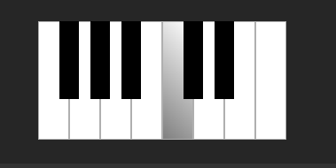

# Testing

Return back to the [README.md](README.md) file.

I have carried out testing to fix bugs and validated the HTML and CSS of each page, results shown below.

## Code Validation
---
I have used the recommended [HTML W3C Validator](https://validator.w3.org) to validate my HTML file.

### HTML

| File | Screenshot | Passed / Notes |
| --- | --- | --- |
Homepage - index.html |  | Yes - no errors |

I have used the recommended [HTML W3C Validator](https://validator.w3.org) to validate all of my HTML files.

- [Validated Site](https://validator.w3.org/nu/?doc=https%3A%2F%2Frhysbobbett.github.io%2Fkoogsynth%2Findex.html)

### CSS

| File | Screenshot | Passed / Notes |
| --- | --- | --- |
Homepage - index.html |  | Yes - no errors |

I have used the recommended [CSS Jigsaw Validator](https://jigsaw.w3.org/css-validator) to validate all of my CSS files.

### JavaScript

I have used the recommended [JShint Validator](https://jshint.com) to validate all of my JS files.

Upon testing I received the following notifications:

-"There are 33 functions in this file.

Function with the largest signature take 1 arguments, while the median is 0.

Largest function has 19 statements in it, while the median is 3.

The most complex function has a cyclomatic complexity value of 7 while the median is 1.

Four warnings
3	Bad constructor.
138	The body of a for in should be wrapped in an if statement to filter unwanted properties from the prototype.
145	The body of a for in should be wrapped in an if statement to filter unwanted properties from the prototype.
152	The body of a for in should be wrapped in an if statement to filter unwanted properties from the prototype."

- The 4 warnings I received were related to the following issues:
The 'bad constructor' is the way in which the audio API creates a 'new' audio context, and JSHint cannot by itself, comprehend the complexity of this constructor. It must be wrong about the meaning as the audio context of the web audio API starts when I declare it, and not automatically as JShint is expecting it to it seems, this would require an alternative version of the script.js code to interpret if this is the case.
The errors at 138, 145 and 152 relate the way a for in statement is called in an array. I can't see any other acceptable way of calling the 
oscillator frequencies from the array in any other way as the values can change when the octave changes.

| File | Screenshot | 
| --- | --- | 
| script.js |  |  

## Browser Compatibility
---
I have tested the site on various desktop and mobile browsers, results below:
| Browser | Screenshot | Notes |
| --- | --- | --- |
[Google Chrome](https://www.google.com/chrome) | | No issues or errors on any page, works consistently. |
[Mozilla Firefox Developer Edition](https://www.mozilla.org/en-GB/firefox/developer/) | | The controls for the sliders do not have the gradient effect applied, other than this everything works fine |
[Microsoft Edge ](https://www.microsoft.com/en-gb/edge) | | No issues or errors on any page  |

## Accessibility testing
---
### Lighthouse Audit Testing
Using Chrome's Lighthouse developer tools, I was able to get a good accesibility score for the index.html page containing the javascript device. I have had to darken some fonts that were originally going to be lighter shades, this was to reach a minimum rating for contrast visibility.  Results are shown in the tables below.

I carried out WAVE accesibility and Chrome Lighthouse tests to test accessibility.

| Test | Screenshot |
| --- | --- |
Google Lighthouse - Mobile Result|  |
Google Lighthouse - Desktop Result|  | 

### WAVE Accessibility Test
|-| Screenshot |
|-| --- |
Test results | 

## Responsiveness
---
I've tested my deployed project on multiple devices to check for responsiveness issues. I used google chrome's developer tools and a few actual devices to test the layout.

Friends who have tried the synthesiser on their devices report that the gradient of the scrollthumb doesn't appear, however they had not stated what device or browser they were using for this to happen. This maybe due to using an older device.

 iPhone 12 Pro (Dev Tools)

| Page | Result | Notes |
| --- | --- | --- |
| index.html | :heavy_check_mark: | no issues |
| script.js | :heavy_check_mark: | |

 Samsung S20 Ultra (Dev Tools)

| Page | Result | Notes |
| --- | --- | --- |
| index.html | :heavy_check_mark: | no issues |
| script.js | :heavy_check_mark: | |

 iPad Air (Dev Tools)

| Page | Result | Notes |
| --- | --- | --- |
| index.html | :heavy_check_mark: | no issues |
| script.js | :heavy_check_mark: | no issues |

 Surface Duo (Dev Tools)

| Page | Result | Notes |
| --- | --- | --- |
| index.html | :heavy_check_mark: | must be scrolled down due to the smaller screen height |
| script.js | :heavy_check_mark: | no issues |

### Responsiveness Conclusion
The app is not particularly suited to large screens, simulating beyond 1080p leaves text too small to effectively read it, and the keyboard does not currently scale with screen size due to the piano layout css styling.  Space is currently wasted on devices with a height over 900px. However, this in time could be filled more effective with additional modules, but it would still require optimisation for larger screens (4k monitors, ultrawide etc).

## User Story Testing
---
| User Story | Screenshot |
| --- | --- |
| As a new site user,  I would like to change waveforms, so that I can experiment with different combinations. | 
|The parameters of the sliders mean there are millions of combinations combined with the 8 possible combinations of the 2 waveform selectors |
| As a new site user, I would like to clearly see what notes I am playing onscreen, so that I can learn the piano notes. |  |
|The mouse hover shows which note you are would be playing, and has collision prevention to stop crashes when trying to play other notes at the same time, but it doesn't yet tell you the note name you are playing or apply the css changes when the keyboard is pressed | |
| As a new site user, I would like to turn the volume up or down, so that I can play quietly. |  |
|Putting the gain slider all the way to the left, puts the gain of the device to 0, therefore there would be no audio output. It can however drastically change the tonality so there are sounds in this range that you can't create if the gain slider is at maximum for example ||
| As a site administrator, I should be able to easily upgrade the code with new features, so that I can improve functionality for the end users. |  |
|The main bulk of the oscillator's code and connection is set within the playNote function. To add additional features to this synthesiser, it would not be too difficult to add effects such as delay contained within the webaudio API. More oscillators could be added in the same way as the code is constructed here and triggered by the same listeners used.||
| As a site administrator, I should be able to read the code easily with good note headings,so that I can make necessary amendments in the future. |  |
|The code is noted for each part and the state of function it might be in. The event listeners are marked out in the notes ||
| As a site administrator, I should be able to understand each oscillator module, so that I can create new functionality by linking new nodes. | As stated above due to notation of the functions and easily functionality of the oscillators, it would be easily possible to add more functionality to the existing setup used, but additional oscillators would not be difficult to add either |

## Bugs
---
>BUG: Very early in development of the synthesiser, an attempt was made to use external [JSAudioknobs](https://github.com/ColinBD/JSAudioKnobs) to control the oscillators but these proved to be difficult to code for a mobile touch interface. 
- Possible fix: They look very professional so a return to that feature may be an option in the future, if I can work out how to make them work on touch devices.

---
>BUG : Certain features were cut as they imposed too much tecnical development knowledge on the project such as noise control and additional controls for a VCA filter (VCF). These were conflicting with the use of the LFO sliders due to my limited understanding of electrical engineering and how such oscillators fit together as required, and in what order. Only a single tone would play with VCA gain and a biQuadFilter from the webaudio API, no modulation was possible.
- This was fixed once the features were removed.

## Unfixed bugs
---
>BUG : A bug that remains is if a user is playing a note and changes a waveform from the dropdown selectors, it may hold that previous tone and prevent it from stopping effectively. 
- Possible Fix: It is possible that an event listener maybe required to logically work out if a note is being held while a selection is being made to prevent this. Refreshing does not always solve the issue.
---
>BUG: Not so much a bug but a user perception, most users appear to assume the synthesiser will automatically start.

- Fix: Due to requirements, it must start with the audio API disabled, but an automatic startup would not be difficult to implement by removing the power button.
---
>BUG:Screen sizes would require extensive reworking of the keyboard layout to work effectively.

- Possible Fix: create a dynamically expanding keyboard and octave system so larger devices can utilise more keyboard range. MIDI input would make this highly appealing so users can use their full keyboard (often up to 88 keys of range)

There are no remaining bugs that I am aware of.
